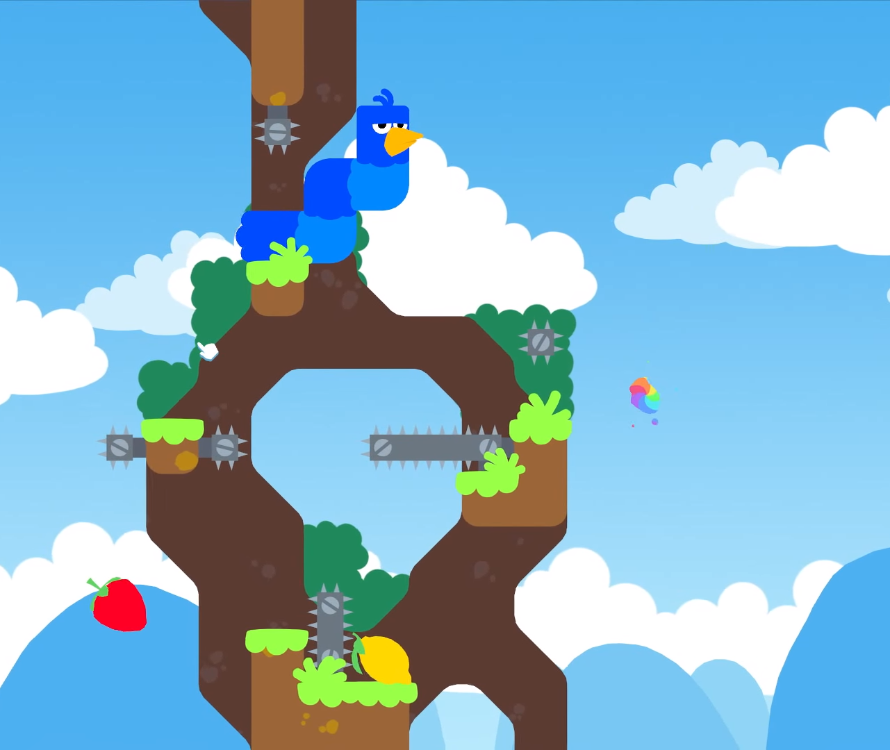
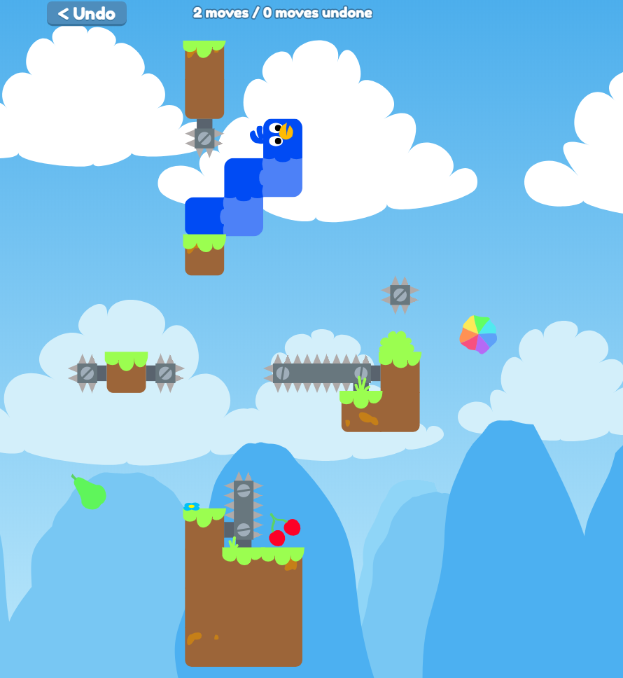

# Snakebird

This is an implementation of Snakebird in JavaScript. The original
game was published by [Noumenon Games](http://noumenongames.com/)
and can be bought...
* ...on [Steam](https://store.steampowered.com/app/357300/Snakebird/)
* ...on [Google Play Store](https://play.google.com/store/apps/details?id=com.NoumenonGames.SnakeBird_Touch)
* ...on [Apple App Store](https://itunes.apple.com/de/app/snakebird/id1087075743?mt=8)

The game is mostly finished. Some small changes could still be made from time to time.

You can currently play all the original levels at
[https://vinsmokesomya.github.io/Snakebird/](https://vinsmokesomya.github.io/Snakebird/) or clone the
repository and open index.html. 

## Original vs. JS implementation

Original:

JS implementation:

